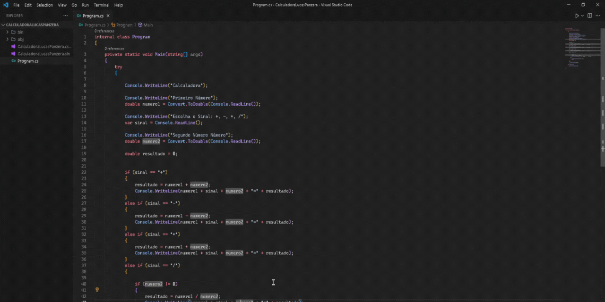

# Calculadora em C# 🖩
 </br>
Projeto de calculadora simples em C#, usando estruturas condicionais (if, else...) para as validações matemáticas.



## Tecnologias Utilizadas 🛠️
<div align="left">
  
  
  
</div>

## 🚀 Como Executar o Projeto
```bash
# Clone este repositório
$ git clone https://github.com/lucaspanzera1/Calculadora.git

# Acesse a pasta do projeto
$ cd Calculadora

# No terminal, rode o projeto
dotnet run

# AVISO! Pode ser necessário instalar a extensão "C# Dev Kit" da Microsoft 

```
